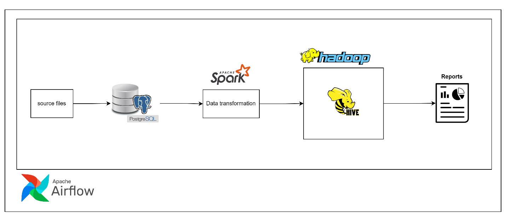
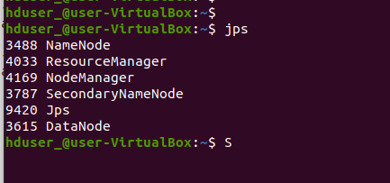

# Project's Title

This project is going to show up how to create an End-to-End data pipeline, that be able to transport automatically raw data through traditional repository 
and distributed system on a scheduler and eventually delivery a summarized data.

# Project Description

In this project, we're going to build a batch data pipeline to ingest raw source data as csv file into Postgres database. 
Then, implementing data transformation following business requirements by using Apache spark. After that, the transformed 
data will be delivered to data warehouse(Apache hive) and save it in partition format as parquet file. Moreover, we will create 
external tables to read the parquet files from Hadoop system. Finally, the data pipeline will be triggered 
on a scheduler in order to run automatically by using Apache airflow.

# Design system

As you can see a below picture, we will be using Apache Airflow to orchestrate the following tasks:
-	Ingesting csv files from local PC and loading it into RDBMS database (Postgres)
-	Extracting and Transforming data from Postgres and loading it into a data warehouse (Hive) with Apache Spark
-	Summarizing the transformed data to do reports and save the outputs as file on PC



# Prerequisite
Before starting the project, you need to install a set of prerequisite on your system.
-	Apache Hadoop
-	Apache Spark
-	Apache hive
-	Apache Airflow
-	Postgres
-	Python3
-	Any preferred editor tool (jupyter notebook)

# Deployment

### Python file
-	Creating a folder to store all source files

### Postgres
-	Creating a user, database name, and schema name 
```
CREATE USER <user_name> WITH PASSWORD <user_password>;
CREATE DATABASE <db_name>;
CREATE SCHEMA <schema_nmae>;
```
-	Defining permission of the user to access database and schema
```
ALTER DATABASE <db_name> OWNER TO <user_name>;
ALTER SCHEMA <schema_name> OWNER TO <user_name>;
``` 
-	Creating tables 

*** you can get sql queries for creating tables in a source folder "xxxxx.sql"


### Apache Hadoop
-	Starting Hadoop service on a terminal 
```
start-all.sh
```
-	Checking the Hadoop service, it is open properly or not (The system will start properly, it needs to show an output like below picture)
```
jps
```


-	Creating a main path and sub-directory on hdfs 
```
hadoop dfs -mkdir /<path_name>
hadoop dfs -mkdir /<path_name>/<directory_for_external_table>
```

### Apache hive
-	Go to a folder “bin” in an Apache spark directory that you have already installed
```
cd /<hive_folder>/bin
```
-	Then starting a hive service
```
hive
```
-	Creating a schema 
```
create database <db_name>
location "hdfs://127.0.0.1:9000/<path_name>/<directory_for_external_table>
```
-	Creating external tables with specific paths

*** you can get sql queries for creating tables in a source folder "xxxxx.sql"

### Apache Airflow
-   start an Apache airflow service (a command per terminal) 
```
airflow webserver -p 8080
ariflow scheduler
```
-	Import a python file to a sub-folder “dags” in a folder of apache airflow
```
cp /your_path/result_file/source_code/dags/daily_restaurant_ingestion.py /your_airflow_path/dags
```
-	Modify paths in the file


### Jupyter notebook (optional) 
If you would like to check and run manually my code to see a output of each step, you can use the jupyter notebook to open it
-   start a jupyter notebook
```
jupyter notebook
```

